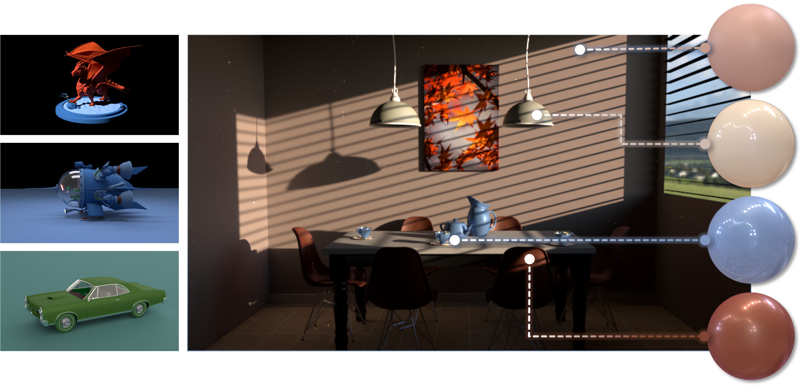

[](https:/peterhuistyping.github.io/NeuMaDiff/) [](https://arxiv.org/abs/2411.12015)  [](https://huggingface.co/Peter2023HuggingFace/NeuMaDiff)  [-green.svg)](https://huggingface.co/datasets/Peter2023HuggingFace/NeuMERL) [](https://www.python.org/)

# NeuMaDiff: Neural Material Synthesis via Hyperdiffusion

<p align="center"><a href="https://chenliang-zhou.github.io">Chenliang Zhou</a>, <a href="https://peterhuistyping.github.io/">Zheyuan Hu</a>, <a href="https://asztr.github.io/">Alejandro Sztrajman</a>, <a href="https://caiyancheng.github.io/academic.html">Yancheng Cai</a>, <a href="https://www.cst.cam.ac.uk/people/yl962">Yaru Liu</a>, <a href="https://www.cl.cam.ac.uk/~aco41/">Cengiz Öztireli</a></p>

<p align="center">Department of Computer Science and Technology<br>University of Cambridge</p>

<p align="center">
    <a href="https:/peterhuistyping.github.io/NeuMaDiff/">[Project page]</a>  
    <a href="https://arxiv.org/abs/2411.12015">[Paper]</a>
    <a href="https://huggingface.co/Peter2023HuggingFace/NeuMaDiff">[Base model weights]</a>
    <a href="https://huggingface.co/datasets/Peter2023HuggingFace/NeuMERL">[NeuMERL dataset]</a>
</p>



3D models and scene rendered with our synthesized neural materials.

# Abstract

High-quality material synthesis is essential for replicating complex surface properties to create realistic digital scenes. However, existing methods often suffer from inefficiencies in time and memory, require domain expertise, or demand extensive training data, with high-dimensional material data further constraining performance. Additionally, most approaches lack multi-modal guidance capabilities and standardized evaluation metrics, limiting control and comparability in synthesis tasks.

To address these limitations, we propose **NeuMaDiff**, a novel **neu**ral **ma**terial synthesis framework utilizing hyper **diff**usion. Our method employs neural fields as a low-dimensional representation and incorporates a multi-modal conditional hyperdiffusion model to learn the distribution over material weights. This enables flexible guidance through inputs such as material type, text descriptions, or reference images, providing greater control over synthesis.

To support future research, we contribute two new material datasets and introduce two BRDF distributional metrics for more rigorous evaluation. We demonstrate the effectiveness of NeuMaDiff through extensive experiments, including a novel statistics-based constrained synthesis approach, which enables the generation of materials of desired categories.

# Dataset and base model

For material synthesis, the weights of the pre-trained base models are uploaded at Hugging Face [Synthesis model weights](https://huggingface.co/Peter2023HuggingFace/NeuMaDiff). Please download the model weights and put them in the `model` folder. (see details [here](model/README.md)).

Our NeuMERL dataset are uploaded at AI community Hugging Face [NeuMERL dataset](https://huggingface.co/datasets/Peter2023HuggingFace/NeuMERL). Please download the model weights and put them in the `data/NeuMERL` folder (see details [here](./data/NeuMERL/README.md)).

* [X] Release of neural augmented MERL BRDF (NeuMERL) dataset.
* [X] Release of pre-trained model weights.
* [X] Release of codebase with README, and Python notebook.

# Installation

Environment: Python 3.10.15 or other compatible versions.

The Pytorch device is set as descending order of CUDA, Apple MPS and CPU (see [device.py](./src/pytorch/utils/device.py)).

```bash
pip install -r requirements.txt
```

# How to run

See the interactive [Python notebook - NeuMaDiff.ipynb](./NeuMaDiff.ipynb) for a step-by-step guide, after downloading the data and model weights.

## NeuMaDiff: Neural Material Synthesis via Hyperdiffusion

- 1. Create the output folder.

```bash
# output folder
mkdir -p output/generation/
```

- 2. Sample synthetic materials from the pre-trained [synthesis model weights](https://huggingface.co/Peter2023HuggingFace/NeuMaDiff).

either

```bash
python src/pytorch/train.py --file_index -1  --pytorch_model_type 2 --sample 1 --model_weights_path model/NeuMaDiff-diversity.pth
```

or

```bash
python src/pytorch/train.py --file_index -1  --pytorch_model_type 2 --sample 1 --model_weights_path model/NeuMaDiff-quality.pth
```

- 3. Create folders for generated materials.

```bash
mkdir -p output/generation/mlp/mlp_gen{0..120}
```

- 4. Extract the MLP model from the npy file.

```bash
python src/tools/merl_workflow/read_mlp_weight.py --file_index -1
```

- 5. Infer the binary files of the synthesized materials from the MLP model, following [MERL](https://www.merl.com/research/downloads/BRDF) format.

```bash
python src/tools/merl_workflow/write_merl_binary.py --file_index -1
```

- 6. Rendering with the synthesized materials.

We use [Mitsuba](https://www.mitsuba-renderer.org/), a physically based renderer, to render the 3D models with the synthesized materials.  You may find [Neural-BRDF](https://github.com/asztr/Neural-BRDF) helpful.

- [Optionally] train a new from scratch.

```bash
python src/pytorch/train.py --file_index -1  --pytorch_model_type 2
```

## Evaluation of synthesized materials

Please update the folder and filename to `.binary` files or render images of reference and synthesized sets.

There are two underlying distance metrics: BRDF space and image space.

- 1. For BRDF space, the demo use `data/merl/blue-metallic-paint.binary` from MERL dataset.

```bash
python src/eval/metrics.py --is_brdf_space 1 --refer_set_size 1  --reference_folder_path "data/merl/" --sample_set_size 1  --sample_folder_path "data/merl/" 
```

- 2. For image space, the demo use `output/img/` folder with rendered images.

```bash
python src/eval/metrics.py --is_brdf_space 0 --refer_set_size 1 --reference_img_path "output/img/" --sample_set_size 1 --sample_img_path "output/img/"
```

## [Optional] NeuMERL: Training MLP from scratch

To train the NeuMERL from scratch, please download MERL dataset from [MERL](https://www.merl.com/research/downloads/BRDF) and put the binary files in the `data/merl` folder (see details [here](./data/merl/README.md)). Please download the [initial model weights](https://huggingface.co/datasets/Peter2023HuggingFace/NeuMERL/blob/main/mlp_weights_ini.pth) and put them in the `model` folder (see details [here](model/README.md)).

- 1. Create the output folder.

```bash
# output folder
mkdir -p output/merl/merl_1/blue-metallic-paint/
```

- 2. Train a NeuMERL MLP model from scratch (file_index = {1, 2, ..., 24}).

```bash
python src/pytorch/train.py --pytorch_model_type 1 --file_index 1  
```

- [Optionally] train multiple models in a loop.

```bash
# For all 24 * 100 materials
bash src/tools/create_folder.sh
```

Set File_index = {1, 2, ..., 24} and set from_list = 1,

```bash
python src/pytorch/train.py --pytorch_model_type 1  --file_index 1   --from_list 1
```

Remark: Each file contain the filenames of 100 materials , and the total number of materials is 24 * 100. The first 1-6 includes 6 * 100 MERL original materials after color channel permutation, and the rest 7-12, 13-18, 19-24 are the interpolated materials.

- 3. Generated the concatenated npy file from the MLP model weights, which is the NeuMERL dataset.

```bash
python src/tools/merl_workflow/read_mlp_weight.py --file_index 1
```

# Citation

Please feel free to contact us if you have any questions or suggestions.

If you found the paper or code useful, please consider citing,

```
@misc{
       NeuMaDiff2024,
      title={NeuMaDiff: Neural Material Synthesis via Hyperdiffusion}, 
      author={Chenliang Zhou and Zheyuan Hu and Alejandro Sztrajman and Yancheng Cai and Yaru Liu and Cengiz Oztireli},
      year={2024},
      eprint={2411.12015},
      archivePrefix={arXiv},
      primaryClass={cs.GR},
      url={https://arxiv.org/abs/2411.12015}, 
}
```

Acknowledgement: We are thankful to the references and the open-source community for their valuable contributions (see our paper and repo [License](./LICENSE) for a detailed list of references).
